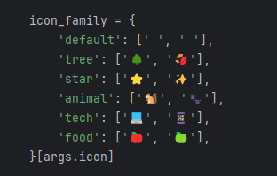
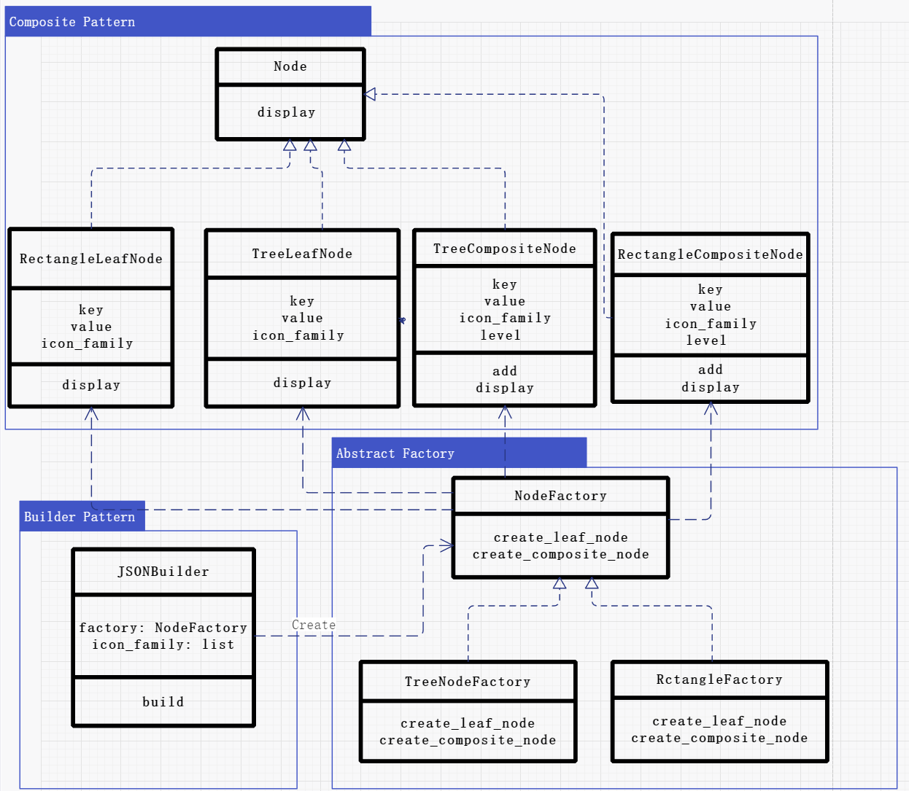
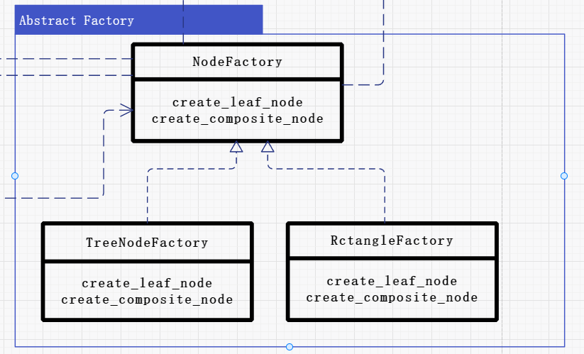
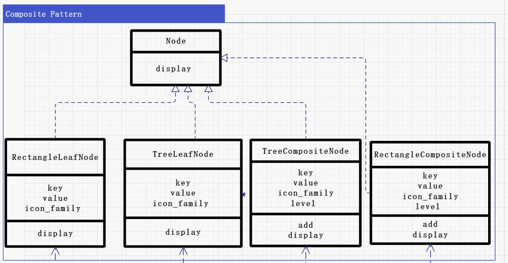
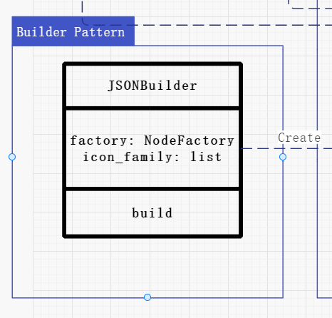
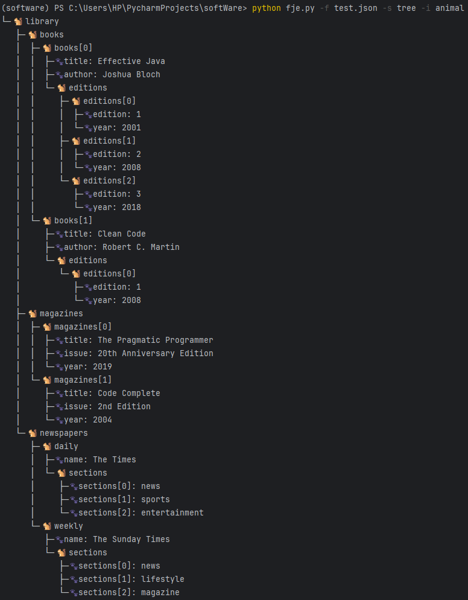
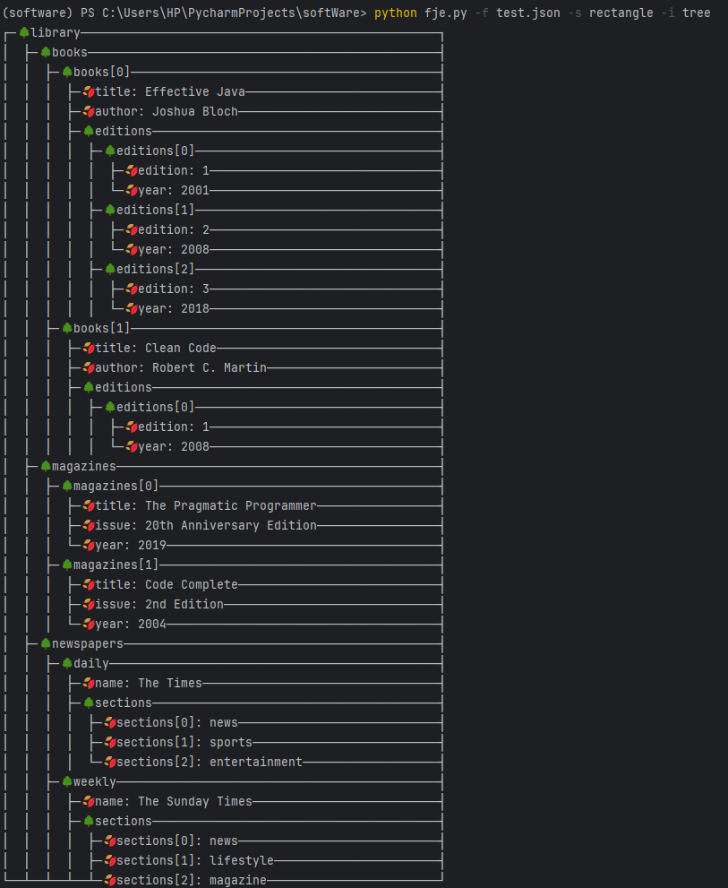
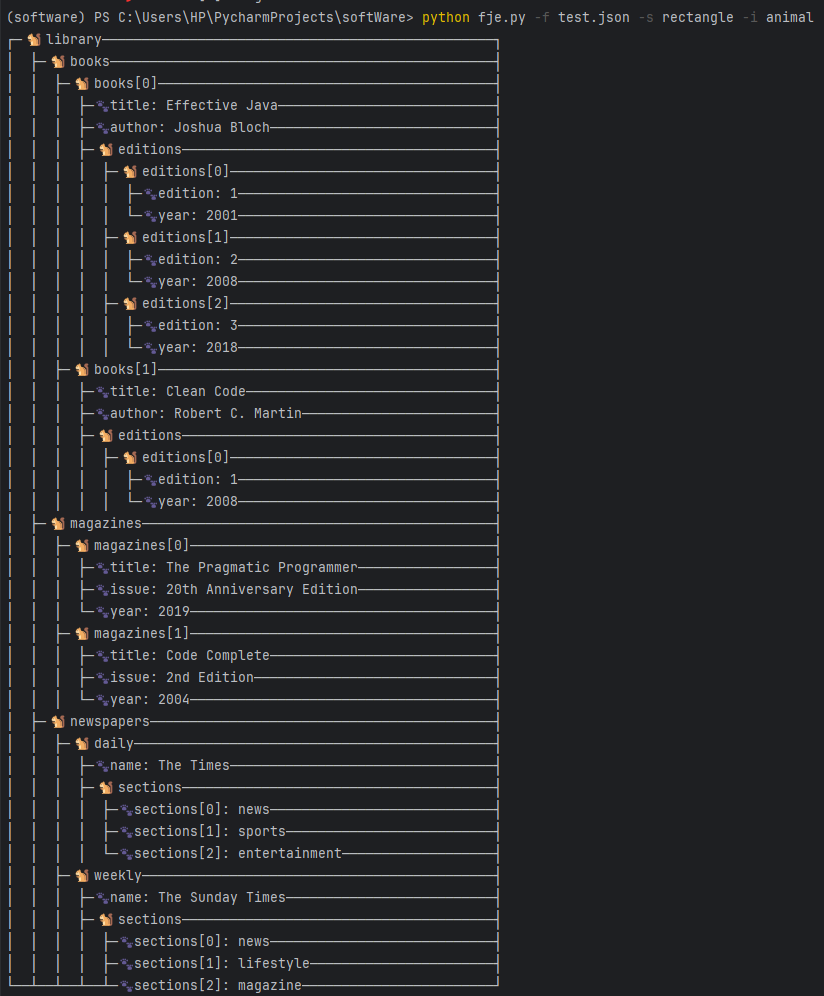

# Funny JSON Explorer 设计文档

### 介绍与使用说明

Funny JSON Explorer（**FJE**），是一个JSON文件可视化的命令行界面小工具：

- 使用python编写完成，**支持所有复杂json格式文档**的可视化；
- FJE可以快速切换**风格**（style），并且内置了包括树形（tree）和矩形（rectangle）在内的两种两种可视化风格的实现；
- 也可以指定**图标族**（icon family），为中间节点或叶节点指定一套icon。工具自带超过五种图标族，同时使用者也可以更改配置文件修改或者添加个性化的图标族；
- 程序采用了抽象工厂的设计模式，使用者可以在不改变原有代码的情况下添加新的风格。

#### 使用方法

将`fje.py`文件存放到要进行可视化的json文件的同一个文件夹下，运行以下指令：

```shell
python fje.py -f <json file> -s <style> -i <icon family>
```

程序就可以读取目标json文件，并将其可视化内容以指定的风格以及图标族在命令行中输出。

假如指定输出风格为矩形`rectangle`，图标族为`tree`，则在命令行中输入以下指令：

```shell
python fje.py -f test.json -s rectangle -i tree
```

则可以得到如下风格的可视化输出：

```
┌─🌳library──────────────────────────────────────────────────┐
│  ├─🌳books─────────────────────────────────────────────────┤
│  │  ├─🌳books[0]───────────────────────────────────────────┤
│  │  │  ├─🍂title: Effective Java───────────────────────────┤
│  │  │  ├─🌳editions────────────────────────────────────────┤
│  │  │  │  ├─🌳editions[0]──────────────────────────────────┤
│  │  │  │  │  ├─🍂edition: 1────────────────────────────────┤
│  │  │  │  │  └─🍂year: 2001────────────────────────────────┤
│  │  │  │  ├─🌳editions[1]──────────────────────────────────┤
│  │  │  │  │  ├─🍂edition: 2────────────────────────────────┤
│  │  │  │  │  └─🍂year: 2008────────────────────────────────┤
│  │  ├─🌳books[1]───────────────────────────────────────────┤
│  │  │  ├─🍂title: Clean Code───────────────────────────────┤
│  │  │  ├─🌳editions────────────────────────────────────────┤
│  │  │  │  ├─🌳editions[0]──────────────────────────────────┤
│  │  │  │  │  ├─🍂edition: 1────────────────────────────────┤
│  │  │  │  │  └─🍂year: 2008────────────────────────────────┤
│  ├─🌳magazines─────────────────────────────────────────────┤
│  │  ├─🌳magazines[0]───────────────────────────────────────┤
│  │  │  ├─🍂title: The Pragmatic Programmer─────────────────┤
│  │  │  └─🍂year: 2019──────────────────────────────────────┤
│  │  ├─🌳magazines[1]───────────────────────────────────────┤
│  │  │  ├─🍂title: Code Complete────────────────────────────┤
│  │  │  └─🍂year: 2004──────────────────────────────────────┤
│  ├─🌳newspapers────────────────────────────────────────────┤
│  │  ├─🌳daily──────────────────────────────────────────────┤
│  │  │  ├─🍂name: The Times─────────────────────────────────┤
│  │  │  ├─🌳sections────────────────────────────────────────┤
│  │  │  │  ├─🍂sections[0]: news────────────────────────────┤
│  │  ├─🌳weekly─────────────────────────────────────────────┤
│  │  │  ├─🍂name: The Sunday Times──────────────────────────┤
│  │  │  ├─🌳sections────────────────────────────────────────┤
│  │  │  │  ├─🍂sections[0]: news────────────────────────────┤
│  │  │  │  ├─🍂sections[1]: lifestyle───────────────────────┤
└──┴──┴──┴──┴─🍂sections[2]: magazine────────────────────────┘
```

同时可以修改配置文件添加新的图标族：



### 设计模式

#### 类图

程序类图如下：



#### 设计模式说明

##### 工厂方法

工厂方法模式是一种创建型设计模式，提供了一种将实例化延迟到子类的方法，使得一个类的实例化延迟到子类实现。

程序中`NodeFactory` 抽象类定义了用于创建节点的方法，具体的节点工厂类如 `TreeNodeFactory` 和 `RectangleNodeFactory` 则实现了这些方法，以创建相应的节点类型。创建对象的责任被延迟到子类，代码不需要知道实例化的具体类，体现了工厂方法模式的应用。实现了节点创建的灵活性和扩展性，使得程序可以轻松地支持不同类型的节点和展示风格。

##### 抽象工厂方法

抽象工厂模式提供一个接口，用于创建一系列相关或相互依赖的对象，而无需指定它们的具体类。通过使用抽象工厂模式，可以在不改变客户端代码的情况下更换产品系列。

- **抽象工厂类 `NodeFactory`**：定义了两个方法 `create_leaf_node` 和 `create_composite_node`，用于创建叶子节点和复合节点。
- **具体工厂类 `TreeNodeFactory` 和 `RectangleNodeFactory`**：分别实现了创建树形结构节点和矩形结构节点的方法。




#####  组合模式

组合模式用于将对象组合成树形结构以表示“部分-整体”的层次结构。组合模式使得用户对单个对象和组合对象的使用具有一致性。

- **抽象基类 `Node`**：定义了 `display` 方法，用于展示节点信息。
- **具体类 `TreeLeafNode` 和 `TreeCompositeNode`**：实现了树形结构的叶子节点和复合节点。
- **具体类 `RectangleLeafNode` 和 `RectangleCompositeNode`**：实现了矩形结构的叶子节点和复合节点。




##### 建造者模式

建造者模式将一个复杂对象的构建与它的表示分离，使得同样的构建过程可以创建不同的表示。通过建造者模式，可以一步步地创建一个复杂的对象。

- **类 `JSONBuilder`**：接收一个节点工厂和图标族，通过解析 JSON 数据来构建节点树。

  


#### 运行截图

采用树风格和矩形风格，并且使用`tree`和`animal`图标族的运行结果如下：

（1）


（2）



（3）



（4）



#### 源代码库

公开可访问的Github repo URL：https://github.com/BasaErmi/Funny-JSON-Explorer-FJE

